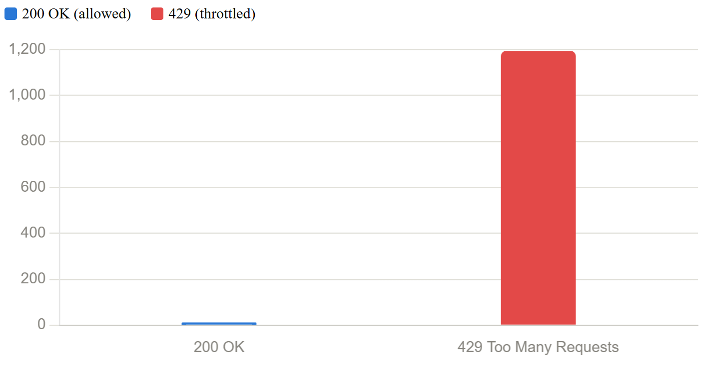

# Sentinel Gateway

     

Sentinel Gateway is a production-inspired distributed API gateway built with Spring Boot that performs JWT authentication, Redis-backed distributed rate limiting, circuit breaking, and intelligent request routing across multiple backend services. Under a concurrent k6 load test, it processed over 1,200 requests while correctly throttling excess traffic with HTTP 429 responses.

## Project stats

- Docker containers orchestrated via Docker Compose: 4
- Independent Spring Boot services + Redis: 3 + 1
- JWT authentication at the gateway (trust boundary): yes
- Distributed token bucket rate limiter (Redis-backed): yes
- Circuit breaker with fallback and confirmed auto-recovery: yes
- Load tested with 1,200+ concurrent requests via k6: yes

## Load test results

10 concurrent virtual users hammered a protected endpoint for 15 seconds via [k6](https://k6.io) -- proving the rate limiter holds up under real concurrent pressure, not just sequential manual testing.

| Metric | Value |
|---|---|
| Total requests | 1,206 |
| Successful (200) | 12 |
| Throttled (429) | 1,194 |
| Concurrent virtual users | 10 |
| Test duration | 15s |
| Success rate | 0.99% |
| Throttle rate | 99.01% |



*Since all virtual users originated from one machine, this test demonstrates single-client throttling under concurrency. Per-client isolation was verified separately via Redis key inspection.*

## Architecture

```
                    +----------------------+
                    |   gateway-service    |
                    |      (:8080)         |
                    |                      |
   client --------> |  1. JWT validation   |
                    |  2. Rate limiting    |------> Redis (:6379)
                    |  3. Circuit breaker  |        (rate-limit buckets,
                    |  4. Route by path    |         shared across instances)
                    +----------+-----------+
                               |
                +--------------+--------------+
                v                              v
      +-------------------+          +-------------------+
      | backend-service    |          |  downstream-b      |
      |     (:8081)        |          |     (:8082)        |
      +-------------------+          +-------------------+
```

### Request sequence

```
Client
  |
  | HTTP request + Bearer token
  v
Gateway
  |-- JWT validation --------> 401 if missing/invalid
  |-- Redis rate limit check -> 429 if bucket empty
  |-- Circuit breaker check --> 503 fallback if downstream unhealthy
  v
Backend service
  v
Response --> Client
```

All four services run in Docker containers on a custom bridge network, brought up with a single `docker compose up`.

## Why this exists

Microservice architectures need a single, trusted entry point that can validate requests, protect downstream services from abuse, and fail gracefully when something goes down -- without every individual service reimplementing that logic itself. Sentinel Gateway is that entry point.

## Key features

### Request routing
Built on **Spring Cloud Gateway Server WebMvc**, using a Java `RouterFunction` API rather than hardcoded proxy logic. Adding a new backend is a route definition, not new forwarding code. Routing lookup is O(1) per request.

### JWT authentication (trust boundary)
Every request to a protected route must carry a valid `Authorization: Bearer <token>` header, signed with the same secret used by the associated auth microservice. Requests with a missing, malformed, or invalid signature are rejected with `401` **before** they ever reach a downstream service. JWT verification is O(1) -- signature check plus expiry comparison, no database lookup required.

### Distributed token bucket rate limiter
Implemented with **Bucket4j**, using a token-bucket algorithm with state stored in Redis via a `LettuceBasedProxyManager`, rather than an in-memory counter. This matters for one specific reason: if this gateway were ever scaled to multiple replicas, an in-memory bucket would let a client get multiples of the intended rate limit -- one bucket per instance. Because the bucket lives in Redis, every instance shares the same counter. Redis key lookup is O(1).

Each client is keyed independently (by `X-Forwarded-For` or remote address), so one client exhausting their limit doesn't affect anyone else.

### Circuit breaker
Implemented with **Resilience4j**, wrapping calls to `downstream-b`. If the failure rate within a sliding window of the last 10 calls exceeds 50%, the breaker trips to **open** and immediately returns a fallback response instead of waiting on a service that's clearly struggling. After a 10-second cooldown, it moves to **half-open**, permits a few test calls, and either closes again (service recovered) or re-opens (still failing).

This was tested end-to-end: stopping `downstream-b` produced consistent `503` fallback responses instead of hung requests, and restarting it showed the breaker automatically detect recovery and resume normal routing -- without any manual intervention.

## Tech stack

- **Java 25**, Spring Boot 4.1
- **Spring Cloud Gateway Server WebMvc** -- routing
- **Bucket4j + Redis (Lettuce)** -- distributed token bucket rate limiting
- **JJWT** -- JWT signing/validation
- **Resilience4j** -- circuit breaking
- **Docker Compose** -- multi-service orchestration, custom bridge network
- **k6** -- load testing

## Running it locally

```bash
git clone <repo-url>
cd sentinel-gateway
docker compose up --build
```

This starts Redis, `backend-service`, `downstream-b`, and `gateway-service` together. Once running:

```bash
# Rejected -- no token
curl http://localhost:8080/api/v1/hello

# Accepted -- with a valid JWT
curl -H "Authorization: Bearer <token>" http://localhost:8080/api/v1/hello
```

## Notable challenges solved along the way

- **Spring Cloud Gateway's newer WebMvc variant** uses a different configuration prefix (`spring.cloud.gateway.server.webmvc.routes`) than most published tutorials, which cover the older reactive/WebFlux gateway -- required tracing through actual source and current docs rather than common examples.
- **Bucket4j's rate-limit filter requires a distributed `AsyncProxyManager` bean**, not an in-memory default -- meaning the rate limiter is Redis-backed by necessity, not as an afterthought.
- **Dependency scope mismatches** (`runtime` vs `compile`) caused classes to be available at runtime but not compile-time -- required explicitly declaring `bucket4j-core`/`bucket4j-redis` at matching versions.
- **JVM version alignment between local dev and Docker** -- a Java 25 local environment against a Java 21 Docker base image failed to compile; resolved by matching Docker's JDK version to the local one.

## Production considerations

This project is portfolio/learning-focused, not production-hardened. Known gaps, listed transparently:

- Secrets (JWT signing key) are currently config-file values, not injected via environment variables or a secrets manager
- No distributed tracing or centralized logging across services
- No metrics/observability layer (Prometheus + Grafana would be the natural next step)
- Circuit breaker currently only wraps `downstream-b`, not `backend-service`
- No horizontal scaling test yet (single gateway instance, though the Redis-backed design specifically supports it)

## What's next

- Externalize hardcoded service URIs and the JWT secret into environment variables
- Add a Redis-backed JWT blacklist check at the gateway, reusing blacklist logic from the auth microservice, so revoked tokens are rejected before expiry
- Extend the circuit breaker pattern to `backend-service`
- Add Prometheus metrics and basic observability